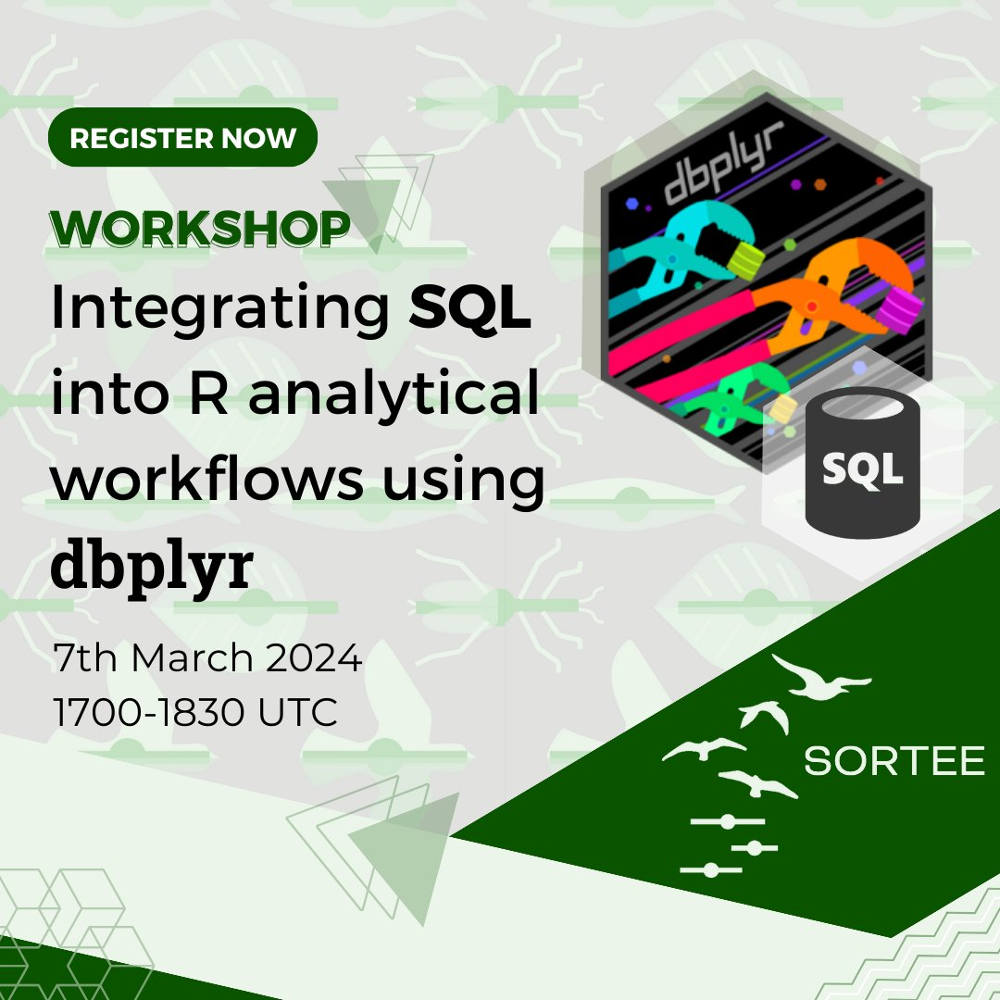

# Integrating SQL into R analytical workflows using duckDB & dbplyr 

When: 7th March 2024, 1700-1830 UTC  (convert to local time)

Where: Register to receive the Zoom link: https://events.humanitix.com/integrating-sql-into-r-analytical-workflows-using-dbplyr

Summary: In this workshop, we will discuss why you might consider a relational database to store environmental data. We will go over how to insert data in and retrieve data from a database using R and duckDB. We will focus on how to use the R dbplyr package to integrate databases into tidyverse-focused analytical workflows.

This workshop will cover these main points:  

- Introduce concepts of a database and discuss why you might want to have/want to use one
- How to integrate the use of a database into an R analytical workflow
- Hands-on exercise using duckDB, dbplyr and how it can be used to learn some SQL basics

### Workshop structure

- 15min [presentation](https://docs.google.com/presentation/d/e/2PACX-1vT7o0wgBzGhMl0XR0N7bDy4z5FWklfD3p4OkRGCRKcRZRJDTgO7T9b7rDp1amzPAYlrIuTsZ5sSp9BL/pub?start=false&loop=false&delayms=10000) on databases and data modelling
- Hands-on [coding session](https://ucsb-library-research-data-services.github.io/intro-database-r/hands-on.html)

